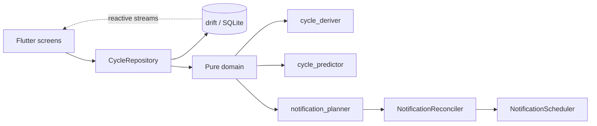

# Aura

An Android app to log your menstrual cycle and estimate its phases. **100% local**: no account, no server, no cloud, no analytics.

[Versión en español](README.md)

> **Status:** v1.0 · Android only · personal portfolio project, in real daily use.

## What it does

- Logs bleeding days, flow intensity, mood, symptoms and notes.
- Derives cycles from those logs (cycles are never created by hand).
- Predicts the next period with a **range** and a confidence level (low / medium / high). The estimated ovulation and fertile window are only shown with medium or high confidence and when the period is not late, and can be hidden in Settings.
- Shows the current phase: menstrual, follicular, ovulatory and luteal (none while the period is late).
- Calendar showing logged days, the estimated days of the current period (dotted border), the estimated fertile window and ovulation (under the same conditions as Home) and multi-day selection.
- Statistics with "Your cycles": typical cycle length, shortest and longest cycle, regularity and typical period length.
- Optional local reminders, with discreet text by default.
- Lets you mark the end of a period and remove marks.
- Backup and restore to a JSON file from Settings → "Your data", with "Undo" after importing.
- Full data wipe from Settings.

## Privacy by design

- Data lives in a SQLite database inside the app's private storage.
- `allowBackup="false"`: Android does not copy it to the cloud.
- Data only leaves the phone if the user creates a backup and chooses where to save it or who to share it with. The file contains health data and, for now, has no password: anyone who opens it can read it. Aura does not receive or keep a copy, and the app still has no `INTERNET` permission.
- Before migrating the database to schema v4, the app saves a safety copy in its private storage; "Delete all data" also removes it.
- Notifications use generic text and private lock-screen visibility unless the user opts into details.
- Privacy policy: [`docs/privacy.html`](docs/privacy.html).

## Architecture



```
lib/
├── domain/        # pure logic, no Flutter or database
│   ├── backup_codec.dart
│   ├── current_period.dart
│   ├── cycle_deriver.dart
│   ├── cycle_predictor.dart
│   ├── fertile_marks.dart
│   ├── legacy_period_ends.dart
│   ├── notification_planner.dart
│   └── range_selection.dart
├── data/
│   ├── backup/          # BackupService + BackupFileGateway (share_plus, file_picker)
│   ├── database/        # drift (schema v5)
│   ├── repositories/    # CycleRepository
│   └── notifications/   # reconciler + scheduler
├── screens/       # home, calendar, add entry, stats, settings, onboarding
└── utils/         # DayKey, colors, strings
```

## Design decisions (and why)

**Dates as `yyyy-MM-dd` text, arithmetic in UTC.** A calendar day is not an instant. Storing it as text avoids time-zone drift. In Chile the DST change happens at midnight, so local midnight sometimes doesn't exist; doing arithmetic on `DayKey` in UTC removes that whole class of bugs.

**Derived cycles, not stored.** Only bleeding days are stored. A new cycle starts when the previous bleeding day is more than 7 days earlier. This gives a single source of truth, and editing one day recomputes everything consistently.

**A pure, testable prediction engine.** Linearly weighted average of the last 6 complete cycles (recent ones weigh more), with a weighted standard deviation. The uncertainty range is `max(1.5·σ, 2 days)` (3 days with fewer than 2 cycles). Ovulation = next period − 14 days; fertile window = ovulation −5 … ovulation. Cycles of 15–60 days are considered valid. Confidence is low with fewer than 2 cycles or when the deviation exceeds 18% of the average; then ovulation and the fertile window are not shown. After more than 60 days without data, the app shows "stale data" instead of a false prediction.

**Pure notification planner + reconciler.** `planNotifications` computes what should be scheduled (a pure function tested with fixed dates). The reconciler diffs that against what's already scheduled and applies the change. A `NotificationScheduler` interface allows a fake in tests.

**`period_day_explicit` (schema v3).** Distinguishes "the user explicitly said there was no bleeding" from a default value. It is a deliberate exception to non-destructive writes, needed so "remove mark" and period-end are reliable.

## How prediction works (and its limits)

Aura uses the **calendar method**: it projects from past cycles. It is an estimate, not a measurement. It uses no basal temperature or hormone tests, so with irregular cycles the range will be wide and confidence low. **It is not a contraceptive method or a medical device.**

## Quality and testing

120+ tests (domain with fixed dates, repository on an in-memory database, planner and reconciler with a fake scheduler). Later verification (code audits and manual testing on the phone) found bugs the initial tests had missed; each fix came with a regression test.

## Running it

Requirements: stable Flutter and JDK 17–21 (not 25).

```bash
flutter pub get
dart run build_runner build --delete-conflicting-outputs
flutter run
flutter test
```

Signed release build: see [`android/RELEASE.md`](android/RELEASE.md). The signing key and `key.properties` are **not** in the repository.

## Not yet implemented

- Password-protected backups (coming with HU-06b)
- Dark mode
- iOS
- English UI locale

## Health notice

Aura provides estimates for informational purposes only. It does not replace advice from a healthcare professional.

## License

All rights reserved. The code is published for viewing and evaluation only; see [LICENSE](LICENSE).
