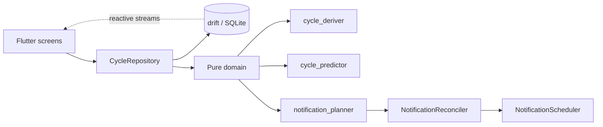

# Aura

An Android app to log your menstrual cycle and estimate its phases. **Local-first**: no account, no server of its own and no analytics. Data lives on the phone and only leaves in a backup the user chooses: a file or, if they turn it on, their own Google Drive.

[Versión en español](README.md)

> **Status:** v1.2.0, in closed testing on Google Play · Android only · personal portfolio project, in real daily use.

## What it does

- Logs bleeding days, flow intensity, mood, symptoms and notes.
- "Me llegó hoy" ("it started today") on Home and in the Calendar: logs only the first day of the period (today, yesterday or another day).
- Derives cycles from those logs (cycles are never created by hand).
- Predicts the next period with a **range** and a confidence level (low / medium / high). The estimated ovulation and fertile window are only shown with medium or high confidence and when the period is not late (on Home, not during the menstrual phase either), and can be hidden in Settings.
- Shows the current phase: menstrual, follicular, ovulatory and luteal (none while the period is late).
- Calendar showing logged days, the estimated days of the current period (dotted border), the estimated fertile window and ovulation (under Home's confidence, lateness and toggle conditions) and multi-day selection; it rolls over to the next day at midnight and has a "Go to today" button.
- Statistics with "Your cycles": typical cycle length, shortest and longest cycle, regularity and typical period length.
- Optional local reminders, with discreet text by default, plus an optional "Did your period arrive?" notice on the first day of lateness.
- Lets you mark the end of a period and remove marks.
- Backup and restore to a JSON file from Settings → "Your data", with an optional password to encrypt the file, "Undo" right after importing, and "Undo last import" in Settings while the pre-import copy exists.
- Backup reminder: if 30 days pass without one, Home shows a card (no notification); it only keeps the date of the last backup on the phone and sends nothing off it.
- **Automatic backup to Google Drive** (optional, off by default) in Settings → "Your data": once a day — when the app is opened, resumed, or a log is saved — it uploads the same encrypted backup file to an **Aura** folder in the user's own Google Drive. The password is chosen once and never leaves the phone: the key is sealed in Android's Keystore, and without that password the file cannot be read. Aura connects to Drive with the `drive.file` scope, which only lets it see the files it creates itself; it can be disconnected from Settings, and "Delete all data" also forgets the account. The build needs an OAuth client ID: see [`docs/DRIVE_SETUP.md`](docs/DRIVE_SETUP.md).
- Full data wipe from Settings (followed by database compaction so no leftovers remain).

## Privacy by design

- Data lives in a SQLite database inside the app's private storage.
- `allowBackup="false"`: Android does not copy it to the cloud, and `dataExtractionRules` blocks direct phone-to-phone transfer over cable or Wi-Fi as well: the only way data leaves is through Aura's own backup file.
- **"Hide Aura from Recents"** (on by default, can be turned off in Settings → Privacy): the app preview in the Recents screen is blank, and screenshots or screen recordings are blocked.
- After deleting all data, the database is compacted (`VACUUM`) and freed pages overwrite what was deleted (`secure_delete`): no remnants of deleted notes or symptoms remain.
- Data only leaves the phone if the user creates a backup and chooses where to save it or who to share it with, or if they turn on the automatic backup to their own Google Drive (optional, see above). The file contains health data. It can be protected with a password (optional): it is encrypted on the phone (AES-256-GCM, with the key derived using Argon2id) and cannot be read without the password (a weak password can be guessed). Aura does not store the password and cannot recover it. Without a password, the file is not encrypted and anyone who opens it can read it. The password protects only the file, not the data inside the phone. Aura does not receive or keep a copy. The `INTERNET` permission exists only for the automatic Drive backup; with it off, the app does not use the network.
- When updating from 1.0 (schema v3), before converting the database the app saves a safety copy in its private storage; it is deleted after saving a backup to the phone, on app start once it is more than 30 days old, or with "Delete all data".
- When an import is confirmed, the app first saves an unencrypted copy of the current data in its private storage, only for "Undo"; the next import replaces it and "Delete all data" removes it.
- Notifications use generic text and private lock-screen visibility unless the user opts into details.
- Privacy policy: [`docs/privacy.html`](docs/privacy.html).

## Architecture


```mermaid
flowchart LR
    UI[Flutter screens] --> Repo[CycleRepository]
    Repo --> DB[(drift / SQLite)]
    Repo --> Dom[Pure domain]
    Dom --> Der[cycle_deriver]
    Dom --> Pred[cycle_predictor]
    Dom --> Plan[notification_planner]
    Plan --> Rec[NotificationReconciler]
    Rec --> Sch[NotificationScheduler]
    DB -. reactive streams .-> UI
```

```
lib/
├── domain/        # pure logic, no Flutter or database
│   ├── backup_codec.dart
│   ├── backup_crypto.dart
│   ├── current_period.dart
│   ├── cycle_deriver.dart
│   ├── cycle_predictor.dart
│   ├── fertile_marks.dart
│   ├── legacy_period_ends.dart
│   ├── notification_planner.dart
│   ├── password_strength.dart
│   └── range_selection.dart
├── data/
│   ├── backup/          # BackupService + BackupFileGateway (share_plus, file_picker) + Drive backup
│   ├── database/        # drift (schema v5)
│   ├── repositories/    # CycleRepository
│   ├── notifications/   # reconciler + scheduler
│   └── device_settings_store.dart  # per-phone settings (no migration needed)
├── screens/       # home, calendar, add entry, stats, settings, onboarding
└── utils/         # DayKey, colors, strings, time zone, Android channels
```

## Design decisions (and why)

**Dates as `yyyy-MM-dd` text, arithmetic in UTC.** A calendar day is not an instant. Storing it as text avoids time-zone drift. In Chile the DST change happens at midnight, so local midnight sometimes doesn't exist; doing arithmetic on `DayKey` in UTC removes that whole class of bugs.

**Derived cycles, not stored.** Only bleeding days are stored. A new cycle starts when the previous bleeding day is more than 7 days earlier. This gives a single source of truth, and editing one day recomputes everything consistently.

**A pure, testable prediction engine.** Linearly weighted average of the **last 6 valid complete cycles** (recent ones weigh more; cycles shorter than 15 or longer than 60 days are filtered out first), with a weighted standard deviation. The uncertainty range is `max(1.5·σ, 2 days)` (3 days with fewer than 2 cycles). Ovulation = next period − 14 days; fertile window = ovulation −5 … ovulation. Confidence is low with fewer than 2 cycles or when the deviation exceeds 18% of the average; then ovulation and the fertile window are not shown, nor if estimated ovulation would fall inside the bleeding period (cycles of 15–19 days), nor while the period is late. Once today is more than 60 days after the start of the last period **and** more than 7 days past the late end of the range, the app shows "stale data" instead of a false prediction.

**Pure notification planner + reconciler.** `planNotifications` computes what should be scheduled (a pure function tested with fixed dates). The reconciler waits until it has both cycles and settings (a half-populated plan would cancel everything already scheduled), runs reconciliations one at a time (the last one wins) and absorbs a plugin failure until the next data change or when the app comes back to the foreground. A `NotificationScheduler` interface allows a fake in tests.

**`period_day_explicit` (schema v3).** Distinguishes "the user explicitly said there was no bleeding" from a default value. It is a deliberate exception to non-destructive writes, needed so "remove mark" and period-end are reliable.

## How prediction works (and its limits)

Aura uses the **calendar method**: it projects from past cycles. It is an estimate, not a measurement. It uses no basal temperature or hormone tests, so with irregular cycles the range will be wide and confidence low. **It is not a contraceptive method or a medical device.**

## Quality and testing

1,296 tests (domain with fixed dates, repository on an in-memory database, planner and reconciler with a fake scheduler, widget tests for the screens, plus manifest and gradle checks run from tests). Later verification (code audits and manual testing on the phone) found bugs the initial tests had missed; each fix came with a regression test.

## Running it

Requirements: stable Flutter and JDK 17–21 (not 25).

```bash
flutter pub get
dart run build_runner build --delete-conflicting-outputs
flutter run
flutter test
```

Signed release build: see [`android/RELEASE.md`](android/RELEASE.md). The signing key and `key.properties` are **not** in the repository.

## Not yet implemented

- Encryption of the data inside the phone (the password protects only the backup file)
- Dark mode
- iOS
- English UI locale

## Health notice

Aura provides estimates for informational purposes only. It does not replace advice from a healthcare professional.

## License

All rights reserved. The code is published for viewing and evaluation only; see [LICENSE](LICENSE).
