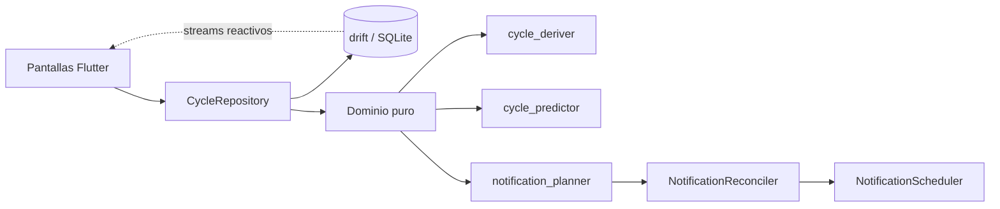

# Aura

Aplicación Android para registrar el ciclo menstrual y estimar sus fases. **100 % local**: sin cuenta, sin servidor, sin nube, sin analítica.

[English version](README.en.md)

> **Estado:** v1.0 · solo Android · proyecto personal de portafolio, en uso real.

## Qué hace

- Registra días de sangrado, intensidad del flujo, ánimo, síntomas y notas.
- Deriva los ciclos a partir de esos registros (no se "crean" ciclos a mano).
- Predice el próximo período con un **rango** y un nivel de confianza (baja / media / alta). La ovulación y la ventana fértil estimadas solo se muestran con confianza media o alta y sin período atrasado, y se pueden ocultar desde Ajustes.
- Muestra la fase actual: menstrual, folicular, ovulatoria y lútea (ninguna con el período atrasado).
- Calendario con los días registrados, los días estimados del período en curso (borde punteado), la ventana fértil y la ovulación estimadas (con las mismas condiciones que Inicio) y selección de varios días.
- Estadísticas con "Tus ciclos": duración típica del ciclo, el más corto y el más largo, regularidad y duración típica del período.
- Recordatorios locales (opcionales) con texto discreto por defecto.
- Permite marcar el fin del período y quitar marcas.
- Respaldo y restauración en un archivo JSON desde Ajustes → "Tus datos", con contraseña opcional para cifrar el archivo y "Deshacer" tras importar.
- Borrado total de datos desde Ajustes.

## Privacidad por diseño

- Los datos viven en una base SQLite dentro del almacenamiento privado de la app.
- `allowBackup="false"`: Android no los copia a la nube.
- Los datos solo salen del teléfono si la usuaria crea un respaldo y elige dónde guardarlo o con quién compartirlo. El archivo contiene datos de salud. Se puede proteger con una contraseña (opcional): se cifra en el teléfono (AES-256-GCM, con la clave derivada con Argon2id) y sin la contraseña no se puede leer (una contraseña débil se puede adivinar). Aura no guarda la contraseña ni puede recuperarla. Sin contraseña, el archivo va sin cifrar y cualquiera que lo abra puede leerlo. La contraseña protege solo el archivo, no los datos dentro del teléfono. Aura no recibe ni guarda una copia, y la app sigue sin el permiso `INTERNET`.
- Antes de migrar la base al esquema v4, la app guarda una copia de seguridad en su almacenamiento privado; "Borrar todos los datos" también la elimina.
- Al confirmar una importación, la app guarda antes una copia sin cifrar de los datos actuales en su almacenamiento privado, solo para "Deshacer"; la siguiente importación la reemplaza y "Borrar todos los datos" la elimina.
- Notificaciones con texto genérico y visibilidad privada en pantalla de bloqueo, salvo que el usuario active los detalles.
- Política de privacidad: [`docs/privacy.html`](docs/privacy.html).

## Arquitectura



```
lib/
├── domain/        # lógica pura, sin Flutter ni base de datos
│   ├── backup_codec.dart
│   ├── backup_crypto.dart
│   ├── current_period.dart
│   ├── cycle_deriver.dart
│   ├── cycle_predictor.dart
│   ├── fertile_marks.dart
│   ├── legacy_period_ends.dart
│   ├── notification_planner.dart
│   ├── password_strength.dart
│   └── range_selection.dart
├── data/
│   ├── backup/          # BackupService + BackupFileGateway (share_plus, file_picker)
│   ├── database/        # drift (esquema v5)
│   ├── repositories/    # CycleRepository
│   └── notifications/   # reconciler + scheduler
├── screens/       # home, calendario, registro, estadísticas, ajustes, onboarding
└── utils/         # DayKey, colores, textos
```

## Decisiones de diseño (y por qué)

**Fechas como texto `yyyy-MM-dd` y aritmética en UTC.** Un día del calendario no es un instante. Guardarlo como texto evita corrimientos por zona horaria. En Chile el cambio de hora ocurre a medianoche, así que a veces la medianoche local no existe; operar sobre `DayKey` en UTC elimina esa clase de errores.

**Ciclos derivados, no almacenados.** Solo se guardan los días de sangrado. Un nuevo ciclo empieza cuando el día de sangrado anterior está a más de 7 días. Así hay una única fuente de verdad y editar un día recalcula todo de forma consistente.

**Motor de predicción puro y testeable.** Promedio ponderado linealmente de los últimos 6 ciclos completos (los recientes pesan más), con desviación ponderada. El rango de incertidumbre es `max(1,5·σ, 2 días)` (3 días con menos de 2 ciclos). Ovulación = próximo período − 14 días; ventana fértil = ovulación −5 … ovulación. Se aceptan ciclos de 15 a 60 días. La confianza es baja con menos de 2 ciclos o si la desviación supera el 18 % del promedio; entonces no se muestran la ovulación ni la ventana fértil. Si pasan más de 60 días sin datos, se muestra "datos desactualizados" en vez de una predicción falsa.

**Planificador de notificaciones puro + reconciliador.** `planNotifications` calcula qué debe estar programado (función pura, testeada con fechas fijas). El reconciliador compara con lo ya programado y aplica la diferencia. Una interfaz `NotificationScheduler` permite usar un doble en los tests.

**`period_day_explicit` (esquema v3).** Distingue "el usuario dijo explícitamente que no hubo sangrado" de "valor por defecto". Es una excepción deliberada a las escrituras no destructivas, necesaria para que "quitar marca" y el fin del período sean fiables.

## Cómo funciona la predicción (y sus límites)

Aura usa el **método del calendario**: proyecta a partir de ciclos pasados. Es una estimación, no una medición. No usa temperatura basal ni pruebas hormonales, por lo que con ciclos irregulares el rango será amplio y la confianza baja. **No es un método anticonceptivo ni un dispositivo médico.**

## Calidad y pruebas

Más de 120 tests (dominio con fechas fijas, repositorio con base en memoria, planificador y reconciliador con scheduler falso). La verificación posterior (auditorías de código y pruebas manuales en el teléfono) encontró errores que los tests iniciales no detectaban; cada corrección quedó con su test.

## Cómo ejecutarlo

Requisitos: Flutter estable y JDK 17–21 (no 25).

```bash
flutter pub get
dart run build_runner build --delete-conflicting-outputs
flutter run
flutter test
```

Build de release firmado: ver [`android/RELEASE.md`](android/RELEASE.md). La clave de firma y `key.properties` **no** están en el repositorio.

## Qué no tiene (todavía)

- Cifrado de los datos dentro del teléfono (la contraseña protege solo el archivo del respaldo)
- Modo oscuro
- iOS
- Idioma inglés en la interfaz

## Aviso de salud

Aura ofrece estimaciones con fines informativos. No sustituye la opinión de un profesional de la salud.

## Licencia

Todos los derechos reservados. El código se publica para consulta y evaluación; ver [LICENSE](LICENSE).
